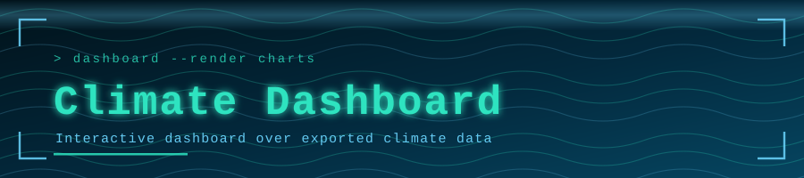

<p align="center">
  
</p>

<p align="center">
  
</p>

<p align="center">
  <a href="https://github.com/muqeetahmaad9/climate-dashboard/stargazers"></a>
  <a href="https://github.com/muqeetahmaad9/climate-dashboard/commits"></a>
  
</p>

---

### 📖 Overview

A dashboard for exploring climate data exported from source APIs into a local JSON store, rendered as interactive charts in the browser.

### ✨ Features

- Python exporter that builds the climate dataset
- Single-page dashboard with interactive charts
- Self-contained — data ships with the repo

### 🧰 Built With

<p align="left">
  
</p>

### 🚀 Getting Started

```bash
python export_climate_data.py   # refresh climate_data.json
# then open dashboard.html
```

### 👤 Author

**Muqeet Ahmad** — AI/ML Engineer · IoT & Embedded Systems Builder

<p align="left">
  <a href="https://www.linkedin.com/in/muqeet--ahmad/"></a>
  <a href="https://muqeetahmaad-portfolio.netlify.app/"></a>
  <a href="mailto:muqeetahmad155@gmail.com"></a>
</p>

<p align="center">
  
</p>
